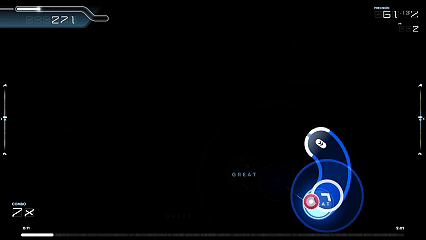

# Osu-player
## Project Overview

This project implements a **real-time AI agent that plays osu! autonomously** using a deep learning model trained on gameplay data.

The system captures screen frames in real time, processes short temporal sequences, and predicts future cursor trajectories directly from visual input.  
The predicted positions are then converted into mouse movements, allowing the model to interact with the game without any hard-coded rules or game-specific logic.

The core of the system is a **CNN + LSTM architecture**:
- The **CNN** extracts spatial features from each video frame.
- The **LSTM** models temporal dependencies across consecutive frames.
- The model predicts **future cursor positions** based on recent visual context.

The entire pipeline operates in real time, including screen capture, preprocessing, inference, trajectory smoothing, and mouse control.

---

## Demo

### GIF Preview

  

*Short preview of the model performing real-time inference.*

---

### Full Gameplay Video
The following video shows the trained model **running in real time and playing autonomously**.  
No commentary or explanation is provided — this is a pure performance demonstration.

▶️ **YouTube video:**  
https://www.youtube.com/watch?v=YOUR_VIDEO_ID
